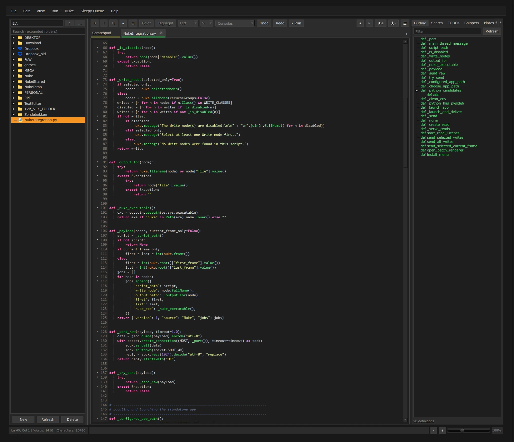
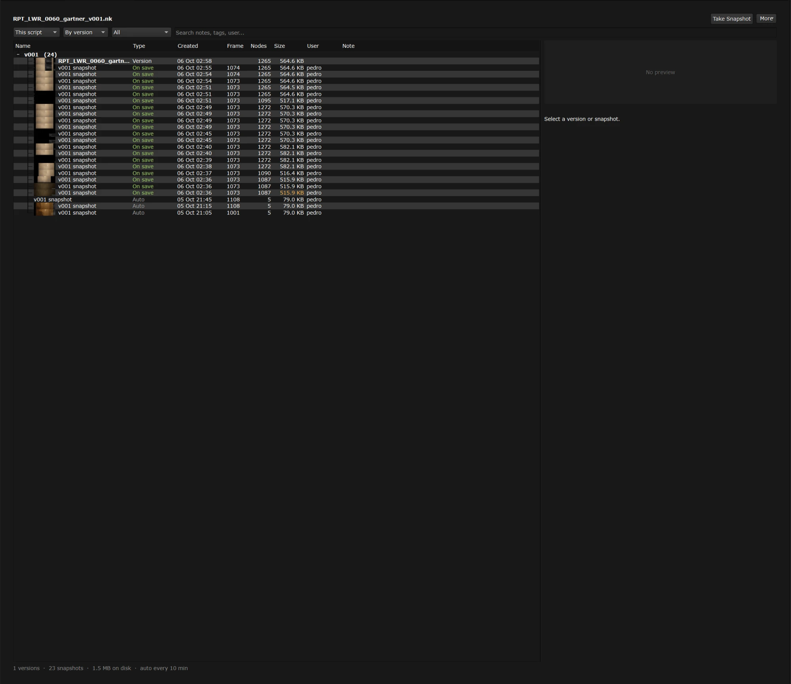
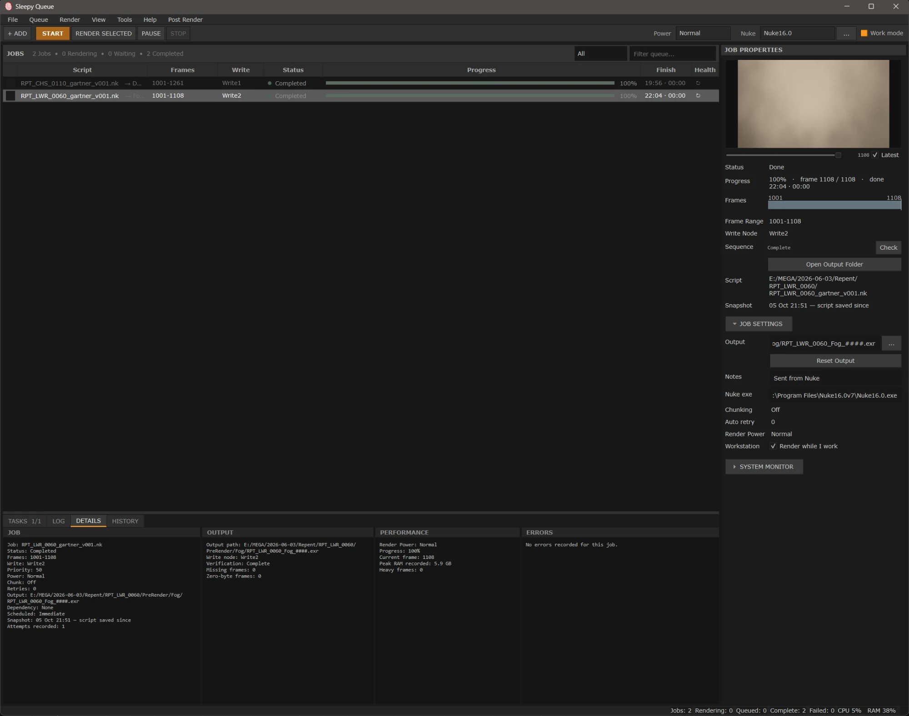
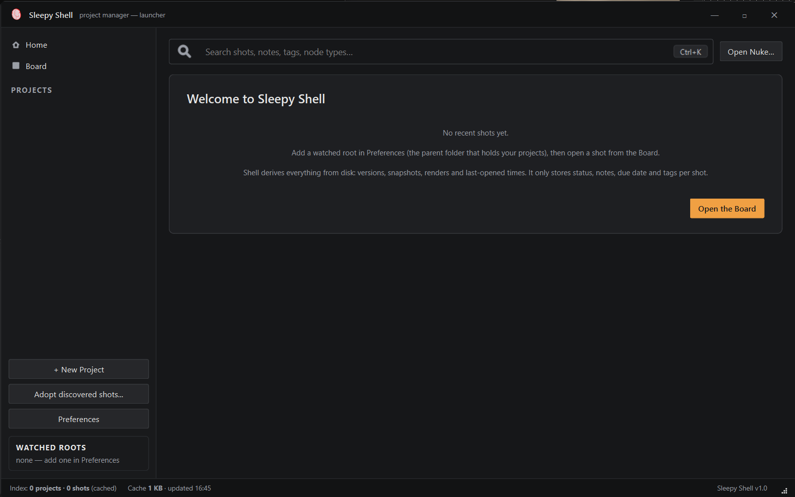
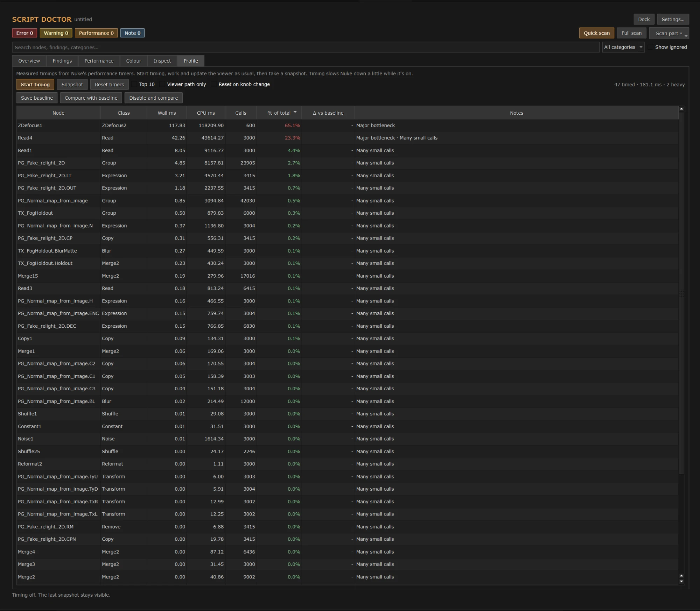
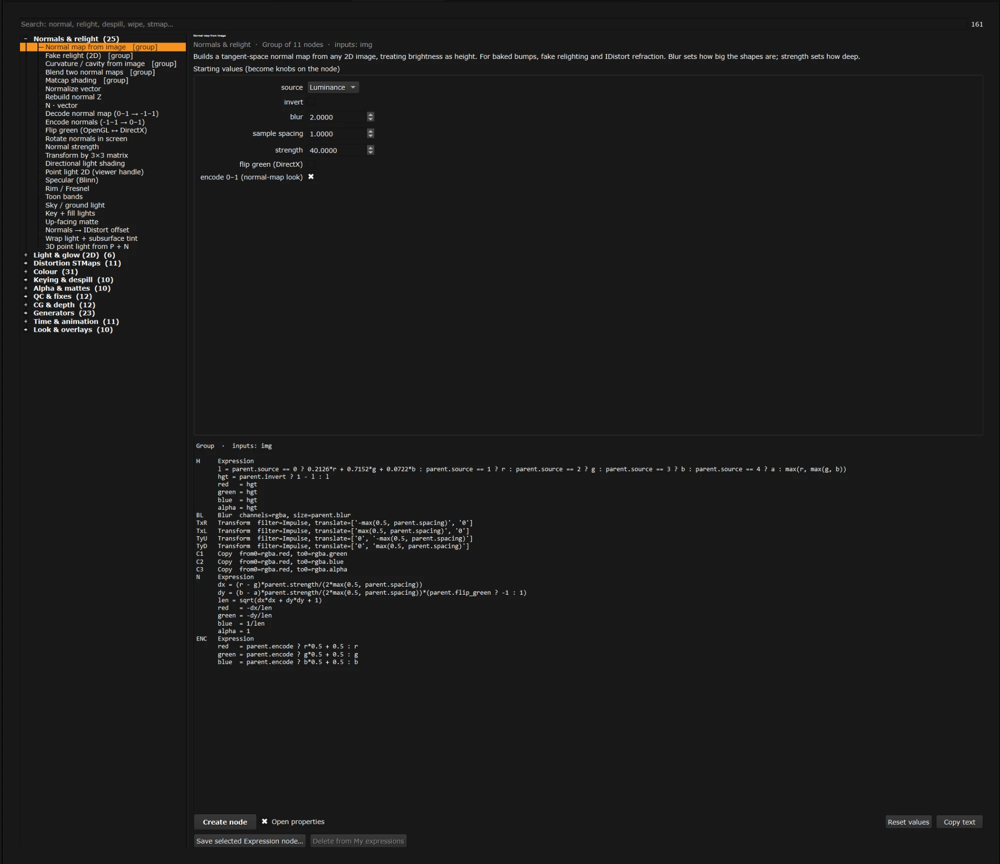
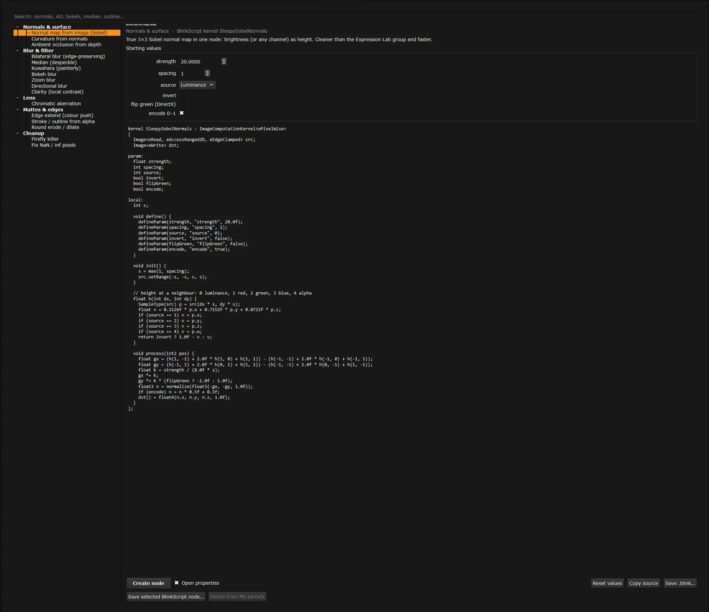
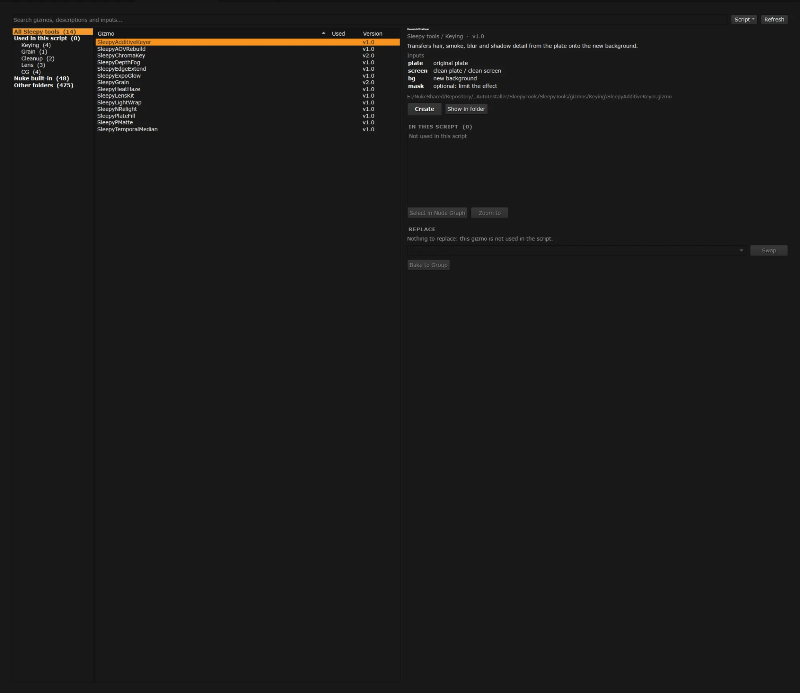

# SleepyTools

A collection of tools for Foundry Nuke / NukeX. Each tool lives in its own folder
and can be installed on its own. Most of them add their menu entries under a single
**`Nuke > SleepyTools`** menu.

## Tools

| Folder | What it does |
|---|---|
| [SleepyBlink](SleepyBlink) | Library of BlinkScript kernels in a dockable panel. Creates ready-made BlinkScript nodes. |
| [SleepyDoctor](SleepyDoctor) | Script Doctor: scans a script for problems (files, renders, expressions, connections, colour, structure, performance). |
| [SleepyExpressions](SleepyExpressions) | Expression Lab: a library of expression recipes you can apply to nodes. |
| [SleepyKnobs](SleepyKnobs) | Right-click a number knob to put a ready-made expression on it, with a live preview and bake to keys. |
| [SleepyLibrary](SleepyLibrary) | Setup Library: save node setups with a thumbnail, tags and notes, and insert them again. |
| [SleepyQueue](SleepyQueue) | Local render queue manager: a standalone app plus a Nuke menu that sends Write nodes to it. |
| [SleepyScrub](SleepyScrub) | Flame-style scrubbing of numeric knob fields, plus a hover info card in the Node Graph. |
| [SleepyShell](SleepyShell) | Project Manager: browse projects and shots, as a docked Nuke panel or a standalone window. |
| [SleepySnapshots](SleepySnapshots) | Timeline of script versions and lightweight snapshots, with diffs and node recovery. |
| [SleepyText](SleepyText) | A text and code editor built into Nuke. |
| [SleepyTools](SleepyTools) | The gizmo pack: 21 gizmos in six categories (Keying, Grain, Cleanup, Lens, CG, QC), a Command Palette, and a Gizmo Manager that shows where gizmos are used, swaps them and bakes them to Groups. |
| [SleepyCore](SleepyCore) | Shared code: Qt 5/6 compatibility, settings, crash log, theme and menu helpers. |

## Screenshots

| | |
|---|---|
|  |  |
|  |  |
|  |  |
|  |  |

## Requirements

- Foundry Nuke or NukeX. The code is written for Nuke 13-15 (PySide2 / Qt 5) and
  Nuke 16 and later (PySide6 / Qt 6), and picks the binding that matches the running
  Nuke. Not every tool has been tested on every Nuke version.
- `SleepyQueue` also needs a normal Python with `PySide6` and `psutil`
  (see its README).

## Installation

1. Copy the folders you want into your `.nuke` folder (`~/.nuke`).
2. Add one line per tool to `~/.nuke/init.py`, for example:

   ```python
   nuke.pluginAddPath('./SleepyCore')
   nuke.pluginAddPath('./SleepyKnobs')
   ```

3. Restart Nuke. Look for the `Nuke > SleepyTools` menu.

Notes:

- **SleepyShell requires `SleepyCore`.** Install both. The other tools use
  `SleepyCore` when it is present and work without it, but installing it is
  recommended.
- **SleepyQueue and SleepyText** have their own install steps. See their READMEs.
- Every tool folder has its own README with details.

## Updating

Replace the tool folder with the new version and restart Nuke. Settings are stored
outside the tool folders, so they are kept.

## License

The code in this repository is released under the [MIT License](LICENSE), except
[SleepyText](SleepyText), which keeps its own BSD-style license in
[SleepyText/LICENSE](SleepyText/LICENSE).

## Disclaimer

SleepyTools is an independent project. It is not affiliated with or endorsed by
Foundry. Nuke and NukeX are trademarks of Foundry Visionmongers Ltd.
